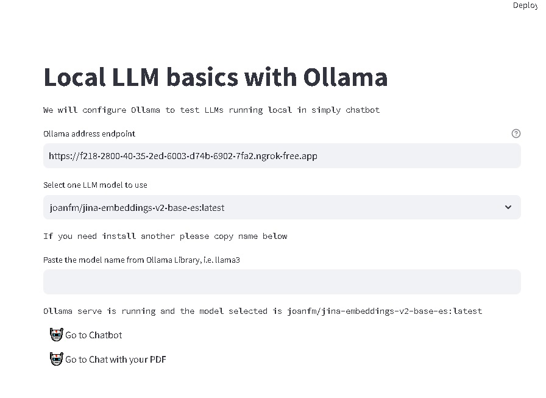
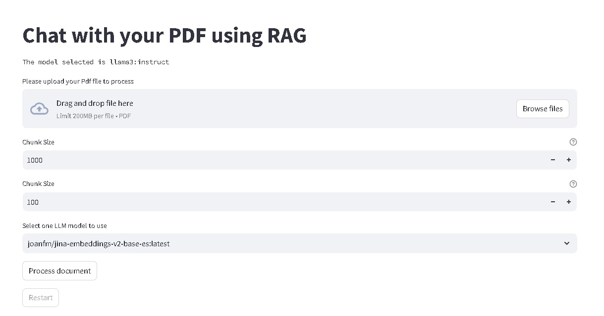

# chatbot_streamlit

Chatbot_streamlit is a simple web application for chatting with an LLM model running in Ollama using Langchain to consume the Ollama API endpoint.
The promt created with Langchain for the chatbot adds memory to chatbot using Streamlit SessionState.




## Installation

Clone this repository [chatbot_streamlit](https://github.com/andresvercesi/chatbot_streamlit).

```bash
git clone https://github.com/andresvercesi/chatbot_streamlit
```
Install require packages 

```bash
pip install -r requirements.txt
```
Download and install Ollama from [here](https://www.ollama.com/download)

Download at least one LLM model from [here](https://www.ollama.com/library) 

For example, to use LLama3 7b Instruct, in Windows cmd : 
```bash
ollama pull llama3:instruct 
```

Download at least one embedding model from [here](https://www.ollama.com/library) 

For example, Mxbai, in Windows cmd : 
```bash
ollama pull mxbai-embed-large 
```


## Usage

Make sure an instance of Ollama is running correctly.

If you use local Ollama in default port check [here](http://localhost:11434).

Run the Streamlit web application: 

```
streamlit run ollama_chatbot.py
```
If you want to chat with an LLM model, go to Chatbot.

If you want to chat with your data, go to Chat with your PDF.




